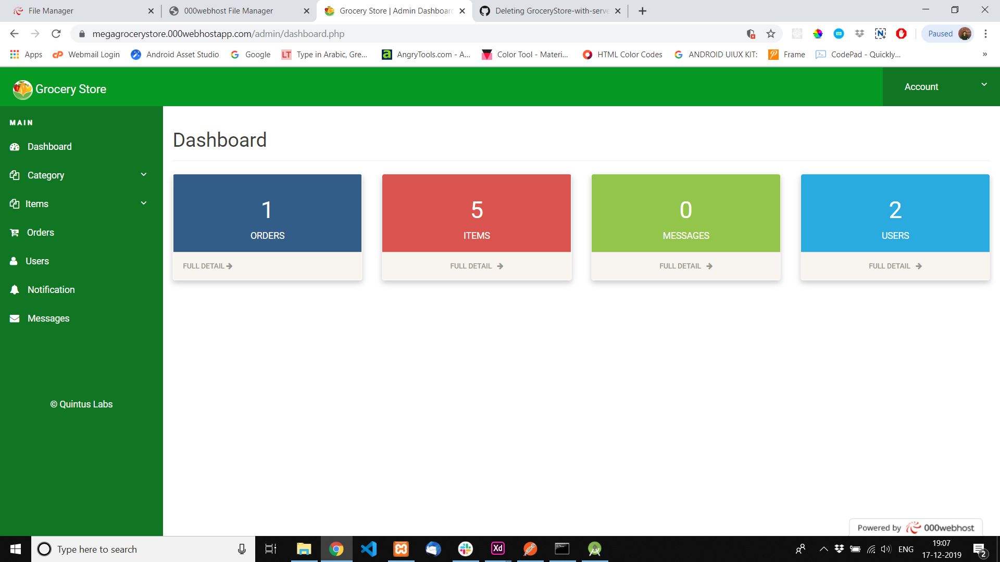
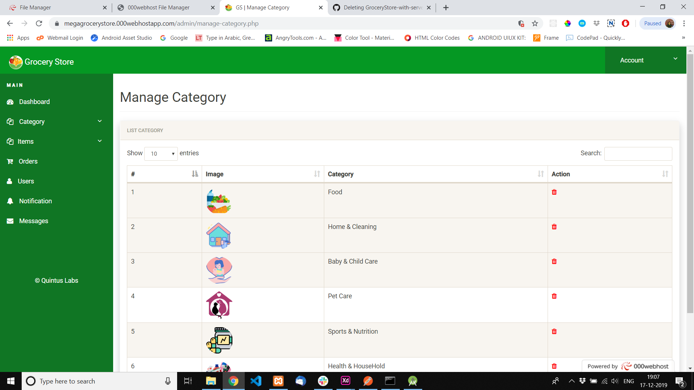
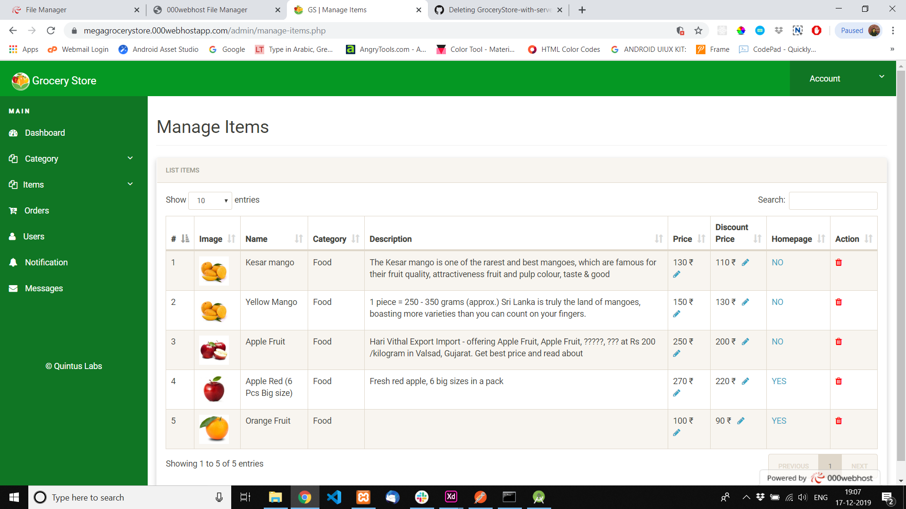
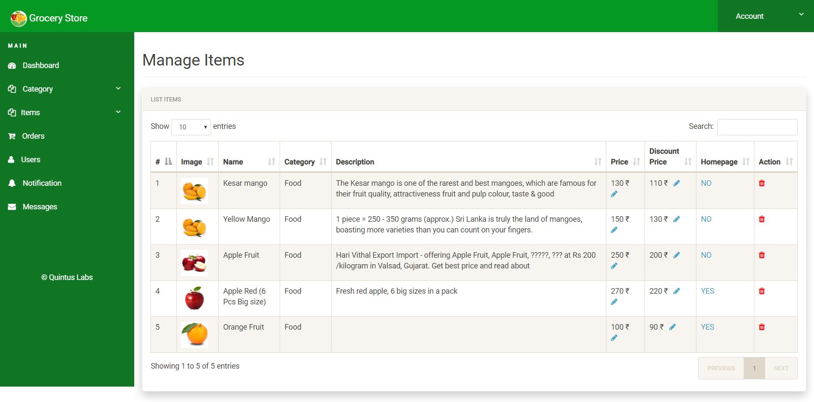

# Grocery Store CMS PHP Restful API

Grocery Store CMS PHP Restful API is an online grocery shop. The project is developed by using PHP/MySQL/Slim Restful API. The project has powerful backend CMS to manage grocery shop online. it has features like add items, remove items, update price, manage orders etc. Restful API ready to embed in Application using JSON data.

### Features

- Powerful Dashboard
- Add , Manage Items
- Add , Manage Category
- Update Price
- View Orders (Confirmed, Preparing, On Way, Dilivered)
- Generate Bills
- Manage Customers
- App Token Authentication

| Screenshot |
| --------------------- |
|  |
|  |
|  |
|  |

### Config

- Config Admin CMS. admin\includes\config.php and set your database server configurations.

```
<?php 
// DB credentials.
define('DB_HOST','localhost');
define('DB_USER','root');
define('DB_PASS','');
define('DB_NAME','grocery');
// Establish database connection.
try
{
$dbh = new PDO("mysql:host=".DB_HOST.";dbname=".DB_NAME,DB_USER, DB_PASS,array(PDO::MYSQL_ATTR_INIT_COMMAND => "SET NAMES 'utf8'"));
}
catch (PDOException $e)
{
exit("Error: " . $e->getMessage());
}
?>
```

- Config App API. app\config.php and set your database server configurations.

```
/* DATABASE CONFIGURATION */
define('DB_SERVER', 'localhost');
define('DB_USERNAME', 'root');
define('DB_PASSWORD', '');
define('DB_DATABASE', 'grocery');
define("BASE_URL", "http://localhost/app/");
define("SITE_KEY", 'yourSecretKey');
```

- Database file included in Repo. (healthykitchendb.sql)

### App API Requests

#### Register User :  
Link : yoursite.com/api/v1/register

```
Request Body :
{
 "fname":"Test",
 "lname":"User",
 "mobile":"0123456789",
 "password":"password"

}

{
  "code": 201,
  "status": "Registeration Successfull !!",
  "userData": {
    "id": "24",
    "fname": "Test",
    "lname": "User",
    "area": "",
    "address": "",
    "state": "",
    "city": "",
    "zip": "",
    "mobile": "0123456789",
    "email": "",
    "password": "5e884898da28047151d0e56f8dc6292773603d0d6aabbdd62a11ef721d1542d8",
    "token": "app963"
  }
}
```

#### Login User :  
Link : yoursite.com/api/v1/login

```
Request Body :
{
 "mobile":"0123456789",
 "password":"password"

}

{
  "code": 200,
  "status": "Login Successfull !!",
  "userData": {
    "id": "24",
    "fname": "Test",
    "lname": "User",
    "area": "",
    "address": "",
    "state": "",
    "city": "",
    "zip": "",
    "mobile": "0123456789",
    "email": "",
    "password": "5e884898da28047151d0e56f8dc6292773603d0d6aabbdd62a11ef721d1542d8",
    "token": "app963"
  }
}
```


#### Get all Category :  
Link : yoursite.com/api/v1/allcategory 

```
Request Body :
{ 
 "token":"app963" 
} 

{
  "code": 200,
  "status": "success",
  "categories": [
    {
      "id": "20",
      "categry": "Food",
      "cateimg": "20191110031135000000.png"
    },
    {
      "id": "21",
      "categry": "Home & Cleaning",
      "cateimg": "20191110031140000000.png"
    },
    {
      "id": "22",
      "categry": "Baby & Child Care",
      "cateimg": "20191110031119000000.png"
    },
    {
      "id": "23",
      "categry": "Pet Care",
      "cateimg": "20191110031138000000.png"
    },
    {
      "id": "24",
      "categry": "Sports & Nutrition",
      "cateimg": "20191110031155000000.png"
    },
    {
      "id": "25",
      "categry": "Health & HouseHold",
      "cateimg": "20191110031113000000.png"
    }
  ]
}
```
#### Get Items Click on Category :  

Link : yoursite.com/api/v1/getlist  

```
Request Body : 
{ 
 "token":"app963", 
 "categry":"Food" 
}  

Response 
{
  "code": 200,
  "status": "success",
  "products": [
    {
      "id": "10",
      "name": "Kesar mango",
      "category": "Food",
      "description": "The Kesar mango is one of the rarest and best mangoes, which are famous for their fruit quality, attractiveness fruit and pulp colour, taste & good",
      "attribute": "1Kg",
      "currency": "Rs.",
      "discount": "110",
      "price": "130",
      "image": "20191110031111000000.png",
      "homepage": ""
    },
    {
      "id": "11",
      "name": "Yellow Mango",
      "category": "Food",
      "description": "1 piece = 250 - 350 grams (approx.) Sri Lanka is truly the land of mangoes, boasting more varieties than you can count on your fingers. ",
      "attribute": "1Kg",
      "currency": "Rs.",
      "discount": "130",
      "price": "150",
      "image": "20191110031155000000.png",
      "homepage": ""
    },
    {
      "id": "13",
      "name": "Apple Fruit",
      "category": "Food",
      "description": "Hari Vithal Export Import - offering Apple Fruit, Apple Fruit, ?????, ??? at Rs 200 /kilogram in Valsad, Gujarat. Get best price and read about",
      "attribute": "1Kg",
      "currency": "Rs.",
      "discount": "200",
      "price": "250",
      "image": "20191110031151000000.png",
      "homepage": ""
    },
    {
      "id": "14",
      "name": "Apple Red (6 Pcs Big size)",
      "category": "Food",
      "description": "Fresh red apple, 6 big sizes in a pack",
      "attribute": "1Kg",
      "currency": "Rs.",
      "discount": "220",
      "price": "270",
      "image": "20191110041121000000.png",
      "homepage": "YES"
    },
    {
      "id": "15",
      "name": "Orange Fruit",
      "category": "Food",
      "description": "",
      "attribute": "1Kg",
      "currency": "Rs.",
      "discount": "90",
      "price": "100",
      "image": "20191110041112000000.png",
      "homepage": "YES"
    }
  ]
}

```
#### Save Customer Information :  
Link : yoursite.com/api/v1/savecustomer 

```
Request Body : 
{ 
 "token":"app963", 
 "fname" : "Bhinderjit", 
 "lname" : "Singh", 
 "mobile" : "7307258973", 
 "area" : "Rayya", 
 "address" : "lohgarh" 
} 
Response 
{ 
    "success": { 
        "text": "Saved Sucessfully" 
    } 
}
```
#### Get Homepage Products :  
Link : yoursite.com/api/v1/homepage 

```
Request Body : 
{ 
 "token":"app963" 
} 
Response 
{
  "code": 200,
  "status": "Success",
  "products": [
    {
      "id": "14",
      "name": "Apple Red (6 Pcs Big size)",
      "category": "Food",
      "description": "Fresh red apple, 6 big sizes in a pack",
      "attribute": "1Kg",
      "currency": "Rs.",
      "discount": "220",
      "price": "270",
      "image": "20191110041121000000.png",
      "homepage": "YES"
    },
    {
      "id": "15",
      "name": "Orange Fruit",
      "category": "Food",
      "description": "",
      "attribute": "1Kg",
      "currency": "Rs.",
      "discount": "90",
      "price": "100",
      "image": "20191110041112000000.png",
      "homepage": "YES"
    }
  ]
}
```
#### Place Order :  
Link : yoursite.com/api/v1/placeorder 

```
Request Body : 
{
  "token": "app963",
  "user_id": "23",
  "address": "Test Address",
  "area": "Bhubaneswar",
  "fname": "Santosh",
  "lname": " ",
  "mobile": "9778178337",
  "orderitems": [
    {
      "attribute": "1Kg",
      "currency": "Rs.",
      "itemImage": "20191110041112000000.png",
      "itemname": "Orange Fruit",
      "itemprice": "100",
      "itemquantity": "2",
      "itemtotal": "200.0"
    },
    {
      "attribute": "1Kg",
      "currency": "Rs.",
      "itemImage": "20191110041121000000.png",
      "itemname": "Apple Red (6 Pcs Big size)",
      "itemprice": "270",
      "itemquantity": "1",
      "itemtotal": "270.0"
    }
  ]
  
}
 
Response 
{"code": 200,"status": "Success"}
```

### Happy Coding...
### Happy Open Source..
